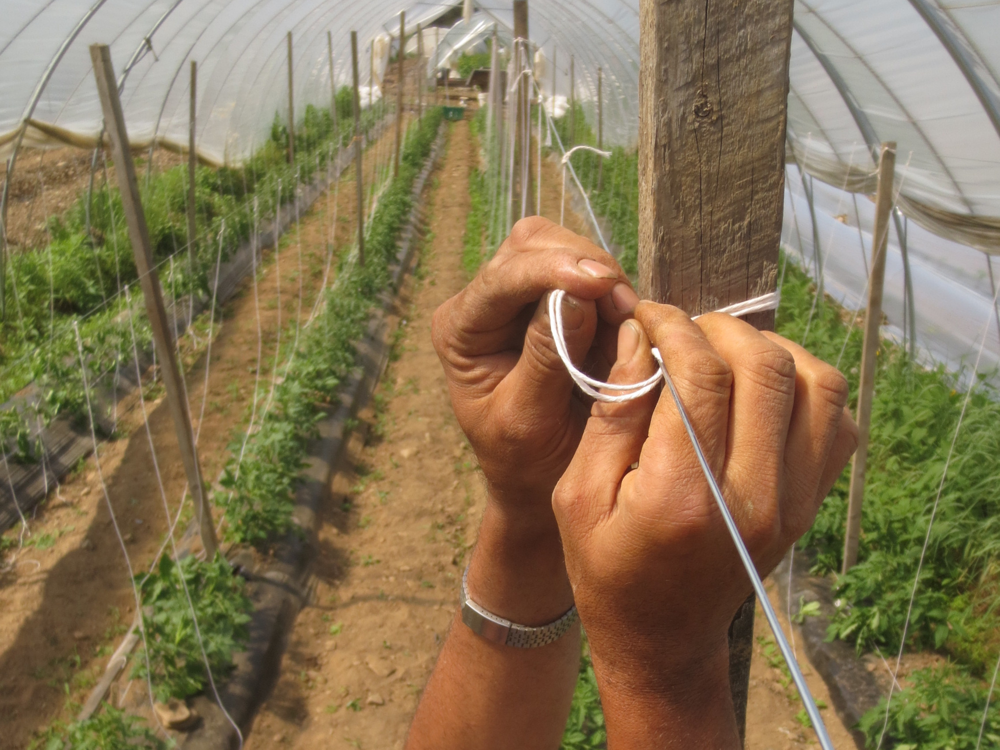

## Modularity of the Problem Set
Farming, to put it mildly, is a complex operation. It is complex in both the
small and the large: from the attention to detail that must be paid for the
successful harvest of a single crop, to the colossal challenge of managing a
range of crops on a diversified farm; from the fine tuning required to make a
local food shed thrive, to the hulking gears that must continually turn to
supply our global food systems. There are vegetable farms, dairy farms, poultry
farms, orchards, ranches, aquaponics, hydroponics and farms that do a little of
everything. There are farms that sell to farmers markets, commodity markets,
wholesale distributors, direct retailers and cooperative food processors, just
to name a few outlets. People farm on wide open prairie and crowded city
rooftops, in controlled greenhouses and seasonal flood plains, high up on rocky
hilltops and down in fertile valleys, in reclaimed forests and abandoned
warehouses. So yea, it's complex to say the least.

Taking it to another level, the unique complexity that one farm faces seldom
shares many aspects with the complexity that another farm faces, even when it's
the farm just down the road. Nevertheless, there is commonality too. Plants
still need the same things to grow, animals the same care to reach market
weight. Sun, soil and water. Energy and nutrients. Space and time.

When I was first learning how to code, I was struck when one farmer told me all
farming boils down to simple inputs and outputs. We call that I/O in computer
science, but it's basically the same thing. Garbage in, garbage out, as the old
saying goes, implying that you can't expect meaningful data to come out of a
program, if the data you put in is junk. This farmer made a similar argument
about soil amendments and yields.

<!-- TODO: Change these first two sentences. -->
Now, I don't want to be too reductive, but I think many farmers do in fact share
the same problems. A farm is distinguished from others only by which problems
they try to solve and which they leave up to other farms. In fact, a farm will
establish its business model based on that problem set, and will carve out its
market niche based on what solutions it provides. Some farms grow for yield,
while some grow for a particular quality. Some farms tackle the logistics of
taking their product all the way to the end consumer, and some hand that off to
their distributor, leaving them to focus on other concerns. To put it in
mathematical terms, there is a superset of problems that all farms share, while
each individual farm only treats a small subset of those problems.

## Modularity of the Data Model
So what does this mean for farm software? How do software engineers try to
manage all this complexity?

Well, one approach would be to focus your software on a single niche,
corresponding to the niche of the farms you're looking to serve. This is a
sensible approach. Software is most successful when it attempts to handle a
constrained set of features. It is akin to what is called, in some programming
paradigms, the Single Responsibility Principle, which states that a piece of
code (eg, a class, function or method) should concern itself with one problem
and one problem only. It's not to say you can't have an overall software system
that handles many concerns, but you try to break down a complex problem to its
most basic constituent problems that are easier to reason about.

The trouble with this approach, however, is that there is seemingly no end to
the level of specialization you need to achieve to get down to an easily defined
problem set. And it seems impractical to have a different app for every little
operation that a farm must perform.

Instead, what I think is required of farming software is a modular approach.

Modularity is a hallmark of software systems going back to the 70's or earlier,
but it's especially attractive to free and open source software (FOSS)
communities. The idea is that, instead of having to create a totally new piece
of software for every use case imaginable, you create one piece of software that
addresses a more general use case. Then, you make it possible for other
developers to build on top of that general foundation, or to _extend_ the
existing software with another piece of software. This is the "module" in
modularity. If you've ever used plugins or extensions in your browser or
elsewhere, you've used software modules.

This is popular in FOSS systems because it delegates much of the complexity of
specialized use cases to other developers, and so large problem sets can be
undertaken in a more distributed way.

To achieve a modular design with farm software we need zoom back out, look again
at that overall superset of problems and find what can be generalized. This
amounts to finding what can be generalized in the data model itself, so that it
can similarly represent a broad superset of data, while also representing the
minute details of a smaller subset of that data.

This is what [farmOS](https://farmos.org) has managed to achieve by founding its
data model on four relatively simple aspects of the farm: logs (ie, events),
assets, areas and people. This has made the data model both resilient, able
accomodate incomplete or fragmentary data, while also flexible, able to target
very specialized forms of data. (Incidentally, it's also one of the reasons I
was eager to work with farmOS, back in the fall of 2017, when I first started
thinking about modular farming software.) Because of this, farmOS has been
deployed by diversified fruit growers in Vermont, row crop farmers in Nebraska,
ranches in California, and even forestry departments in Uganda.

farmOS has been able to develop this versatile data model in just a few short
years because, appropriately enough, it is built with a software framework that
is a touchstone of FOSS modularity: Drupal. Drupal is modular to its core, quite
literally. It allows special farmOS modules to be created which manage
everything from livestock grazing to compliance with FSMA produce safety
regulations. These modules are a way to take that general data model of 4
primary components and build a richer representation of the data that reflects
the particular use case. What's perhaps most important about modules is that
each farm can mix and match them to suit their unique needs, and exclude any
modules that are extraneous to their requirements.

## Modularity of the Interface
The data model is the foundation of a modular system, but there is another level
of modularity that must likewise reflect the diverse problem set of modern
farming. That is the user interface, or UI.

Just like the data model, the UI should be built up from some generalized core
components, which can then be be extended to present a more detailed view of the
farm's operations. And like the data model, these should be interchangeable and
easy to add or remove.

This is where farmOS Field Modules come in. They are modules which can be
installed on your farmOS server, and are then broadcast out to every device that
connects to your farm with farmOS Field Kit. We have quietly released the
underlying features which enable Field Modules, while we have several modules
that are still under development. If you've noticed the addition of the Home
screen to Field Kit, this is why.

The whole raison d'être for Field Kit is to make it easier to capture
farm-related data at its source, in the field. The intention behind Field
Modules is to make it all the easier and more concise to capture just a subset
of that data. Ideally, each Field Module will be paired with a specific use
case, like applying an input, moving animals from one paddock to another, or
just taking simple observations. The modules make up the kit you take to the
field.

Again, the idea is that all modules won't be applicable to every farm's
requirements, and we expect some modules will be highly specialized to only a
single farm's use case. That's part of the design, because no other farm will
need to have those modules cluttering their Home screen.

<!-- TODO: Major updates needed here. -->
Look for these modules to start rolling out towards the end of 2020. It will be
a small sample of modules at first, but we hope the collection will grow
quickly. Eventually, we plan to convert many of the current offering of [Quick
Forms](https://farmos.org/guide/quick/) to Field Modules. As always, we
appreciate any and all feedback as you try out Field Modules in your own
workflow, and if you're interested in helping to develop new modules, either as
a contributor or a sponsor, let us know! We're slowly building out the [API
documentation](https://github.com/farmOS/farmOS-client/blob/develop/API.md) as
this is being written, and hope to encourage many more developers to try out
this new framework as a way of delivering custom solutions to farmers across the
globe.

I'll of course have more updates to come. Keep an eye on the [farmOS
forum](https://farmos.discourse.group) for the latest news on Field Kit and
Field Modules.
